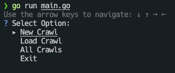
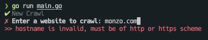
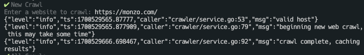
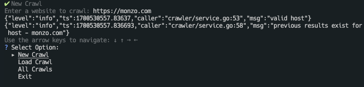

### 👨🏽‍💻 **Sanchit Jain**
---
# 🌍 web-crawler-go
## Overview

#### A web crawling solution, leveraging Go's concurrency features 

The primary focus is on crawling websites within a specific domain, ensuring a systematic and controlled exploration of web resources. By `concurrently fetching and processing` web pages, the crawler maximizes efficiency, ensuring a swift and parallelized exploration of the target domain.

The project also serves as an example of the `Service Repository Layer` pattern, the code is organized into distinct layers, promoting modularity and maintainability. The service layer encapsulates business logic, the repository layer handles data access and storage, and the web crawler integrates seamlessly within this structure.
>This modularity is enforced via Go's implementation of interfaces, and can be found as a salient feature in the repository, crawler-instance, and service layers.


## Components
- **Web Crawler:**
  Concurrency ensures optimal resource utilization, making it suitable for crawling large and complex domains. Multiple instances of this crawler can be initialized as needed.
  - The crawler has a shared channel, and two `syncmaps` to record results and errors.
  - It has a main process that orchestrates pulling links from the shared channel, fetching the link's page and extracting that page's links into the same channel.
  - Safety is ensured via a channel `buffered` at the same capacity as the links channel, this channel tracks threads via `semaphores` (mutex for single thread).[See here for more details](https://medium.com/@deckarep/gos-extended-concurrency-semaphores-part-1-5eeabfa351ce)
  > Web and Concurrency configuration settings can be tweaked, but have default values when a crawler is initialized within the service layer

- **Service Layer:**
  The service layer encapsulates the application's business logic, orchestrating the interactions between the command line interface, the web crawler, and the repository layer. It offers a high-level interface for managing and retrieving crawled data.

- **Repository Layer:**
  Responsible for data access and storage, the repository layer interfaces with the underlying data store. 
  - This separation of concerns enhances maintainability, allowing for easy modifications to the data storage mechanism without affecting the core crawling logic. 
  - It also serves to optimize the crawler by providing a means to persist previous crawl results; thus avoiding repeat processing.
  > 🧠 The current implementation employs the use of an in memory store; but this can be swapped out for another form of persitence like PostGres, as long as the interfaces are satisfied

- **Command Line Menu:**
  The command line menu acts as a user-friendly interface for controlling the web crawler and accessing relevant information. Users can do the following:
  - Initiate a new crawl (command line has built in validation for web schemes)
  - Retrieve an old crawl (command line has built in validation for uuid)
  - Get all the crawls stored in the repository of choice
  > 📝 If this service as a whole were to fit into an overall microservice architecture, the interactive command line can be swapped out of a simple server and route requests to the service layer that remains unchanged.

## Repository Structure

- `example_reports/`: Holds output in `json` from previous runs
  - `screenshots/`: PNG screens of the UI running different modes of the crawler
  - `*.json`: sample outputs from a session 
- `src/`: Holds the main application logic.
  - `util/`: Contains common utilities that all subdomains can use.
    - `concurrency.go`: Helper functions to generate worker settings for any concurrent application.
    - `web.go`: http and URL utility functions.
    - `util_test.go`: testing the helpers.
  - `crawler/`: The main subdomain for the crawler.
    - `instance/`: Directory that houses the web crawler.
      - `instance.go/`: Initializer and orchestration code for the crawler.
      - `instance_test.go/`: Tests pertaining to the crawler instance.
    - `repository.go`: Repository implementations for data access.
    - `repository_test.go`: Repository tests.
    - `service_test/`: Service tests.
    - `service/`: Service implementations containing business logic.
- `config/`: Configuration files for memory store, PostGres connection details can be added here.
  - `datastore.go`: Currently used to create an in memory data-store instance
- `main.go`: The main application file, and is the entry point for the application and where the prompt UI is set up.
> 👆 All tests are written in "table-driven test" style as described by [Dave Cheney](https://dave.cheney.net/2019/05/07/prefer-table-driven-tests)

## Getting Started

Follow these steps to get the project up and running:

1. Clone the repository to your local machine _(or obtain a downloaded copy)_:

   ```
   git clone https://github.com/sjain93/web-crawler-go.git
   ```

2. Navigate to the project directory:

   ```
   cd web-crawler-go
   ```

3. Install any required dependencies:

   ```
   go get -d ./...
   ```

4. To build and run the application:

   ```
   go run main.go
   ```

   By default the repository layer is configured to use a in memory map
   found in the `config` package.

   ```go
   type MemoryStore map[string]interface{}
   ```
## Using the UI
Running `main.go` presents the user with the following menu
>**Note** that the output of all crawls is saved in a `report.json` file



### New Crawl
Selecting a new crawl allows the user to input a web-page with a valid scheme (`http` or `https`). 
A valid entry will kick off the crawl process



Correcting the input is marked with a ✅ indicator on the UI as below


A succesful run will display info-logs:




As well as generate an output report file which is a json version of the following struct
```go
type Metadata struct {
	ID             string
	InitialURL     string
	Host           string
	CrawlResultSet []string
	ErrList        []error
	CreatedAt      time.Time
}
```
> Sample output for a Monzo crawl [here](example_reports/monzo.json)

If the user is trying to initiate a crawl that has already been run with the last **24 hours** a report will be generated from the previous crawl. 
> Note that this functionality's effectivenes depends on the type of persistence used

Here is an example of that:



### Load Crawl
Has a similar inferface as `New Crawl` however, you must use a `uiid` generated from a previous run within the same session of the programn to retrieve existing crawls.

>**Note** that the ID for a crawl MetaData record is currently implemented as a `uuid`

### All Crawls
Will fetch and save all the crawl `Metadata` records saved in the datastore during the current session. No additional input neccesary.


[Other screenshots](example_reports/screenshots)


## Usage

In this pattern, services encapsulate the business logic of your application, while repositories provide data access methods. The service hides the implemnentation details of each crawl instance. Each call to the service method `CrawlSite` spans a new crawl object instancem, with everything that it needs to concurrently crawl the provided URL.


Here's an example of how to use a service:

```go
// Import the necessary packages
import (
	"github.com/sjain93/web-crawler-go/config"
	"github.com/sjain93/web-crawler-go/src/crawler"
	"github.com/sjain93/web-crawler-go/src/util"
	"go.uber.org/zap"
)

// Initialize a logger
logger, err := zap.NewProduction()
if err != nil {
    // handle the error
}

// Initialize the userRepository with an in memory store
memStore := config.GetInMemoryStore()
crawlerRepo, err := crawler.NewCrawlerRepository(memStore)
if err != nil {
    // handle the error
}

// Initialize a service
crawlerSvc := crawler.NewCrawlerService(crawlerRepo, logger)

// Crawling
report, err = crawlerSvc.CrawlSite(crawler.Metadata{InitialURL: ""})
if err != nil {
    // handle the error
}

// The report is a slice of the MetaData object - from here you can choose what to do

```

Within a service, and using an instance of the crawler
```go
import (
	"github.com/sjain93/web-crawler-go/src/crawler/instance"
	"github.com/sjain93/web-crawler-go/src/util"
)

// init new crawler interface
crawler, err := instance.NewCrawler(
    crawlRec.InitialURL,
    instance.Config{
        WokerSetting: util.SetupDefaultConcurrency(),
        HttpClient:   util.NewDefaultHTTPClient(),
    },
)
if err != nil {
    // handle the error
}

// execute the crawl
crawler.Process()

// Populating the metadata object
errList := crawler.GetErrors()

// Get the results of the crawl
validLinks := crawler.GetLinks()
```


## Testing

To run unit tests for services and repositories, use the following command:

```
go test ./... -timeout 200s
```

>- `https://monzo.com` took roughly 95s
>- `https://www.koho.ca` took roughly 15s
---
⚙️ Note that some crawls can take up to 95 seconds, please ensure your environment is configured to timeout accordingly

## License

This project is licensed under the GNU General Public License - see the [LICENSE](./LICENSE) file for details.

---

Made with ♡ in 🇨🇦